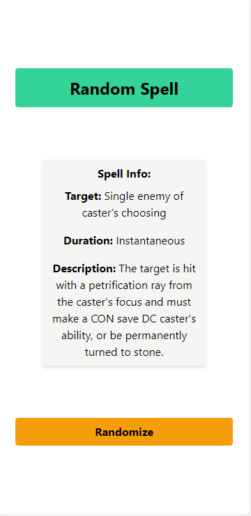

# Spell Randomizer
  ## Description
  Spell Randomizer holds an array of spell descriptions, along with logic to randomize the target, area, duration, etc. for DMs to use as a companion for more variety in items like the Wand of Wonder.

  ## License
  

  ## Table of Contents
  1. [Installation](#Installation)
  2. [Deployment](#Deployment)
  3. [Usage](#Usage)
  4. [Screenshot](#Screenshot)
  5. [Contributing](#Contributing)
  6. [Technologies](#Technologies)
  7. [Tests](#Tests)
  8. [Questions](#Questions)

  ## Installation
  No installation necessary - see "Deployment"

  ## Deployment
  !Link[]

  ## Usage
  Use this app to add some variety to any of your magic items, wild magic, or whatever else you would like to have interesting and unpredictable effects.  The randomized nature of the target and duration also adds some variety to otherwise-static spell targets or timelines.

  ## Screenshot
  

  ## Contributing
  Please do feel free to send suggestions for additional spells/effects or improvements!

  ## Technologies
  * Javascript
  * HTML
  * TailwindCSS (CDN. Fight me.)

  ## Tests
  No testing frameworks were used in the development of this project, and it does not contain test files.

  ## Questions
  [Check out my GitHub](https://github.com/LumberJon1)
  --or--
  Email me at JWilliams12117@gmail.com